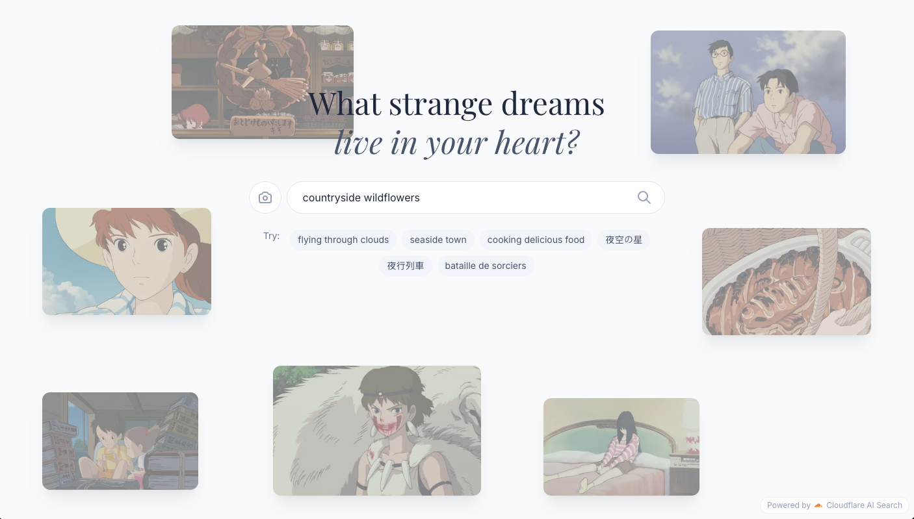
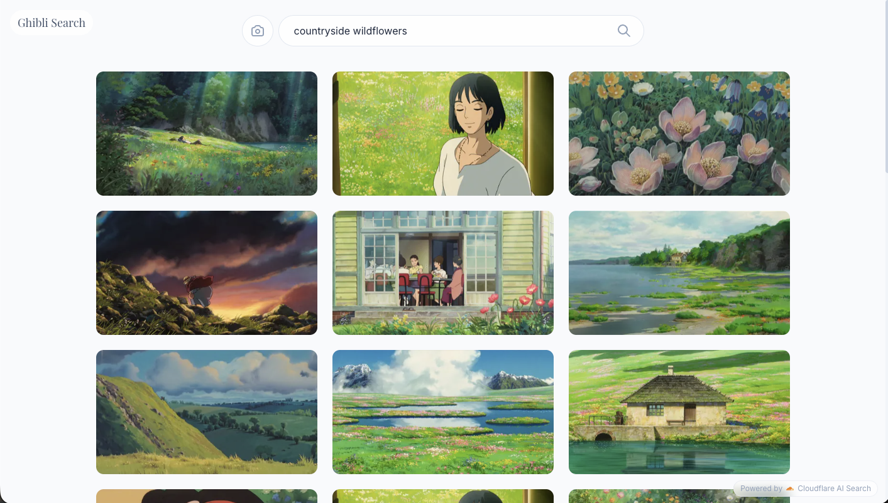
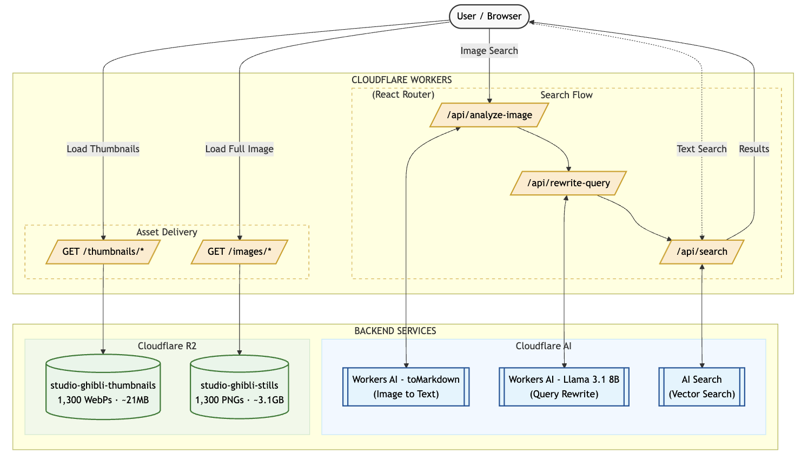

# Studio Ghibli Search

A semantic search engine for Studio Ghibli movie stills, powered by Cloudflare Developer Platform.

**Live Demo:** [ghibli-search.anini.workers.dev](https://ghibli-search.anini.workers.dev/)

<p align="center">
  
  &nbsp;&nbsp;
  
</p>

## Features

- **Semantic search** - Find scenes using natural language queries like "flying through clouds" or "rainy day"
- **Image search** - Upload an image to find visually similar Ghibli scenes

## Architecture



## Tech Stack

- [React Router 7](https://reactrouter.com/) - Full-stack React framework
- [Cloudflare Workers](https://workers.cloudflare.com/) - Serverless functions
- [Cloudflare AI Search (AutoRAG)](https://developers.cloudflare.com/ai-search/) - Semantic search over images
- [Cloudflare R2](https://developers.cloudflare.com/r2/) - Image storage
- [TailwindCSS 4](https://tailwindcss.com/) - Styling
- TypeScript

## Prerequisites

- Node.js 18+
- A [Cloudflare account](https://dash.cloudflare.com/sign-up)
- [Wrangler CLI](https://developers.cloudflare.com/workers/wrangler/install-and-update/)

## Setup

### 1. Clone and install dependencies

```bash
git clone https://github.com/aninibread/ghibli-search.git
cd ghibli-search
npm install
```

### 2. Configure Cloudflare resources

You'll need to set up the following Cloudflare resources:

#### R2 Bucket
Create an R2 bucket and upload your images with the naming convention:
```
(YEAR) Movie Name/Scene Description.png
```
Example: `(1988) My Neighbor Totoro/Flying Through the Sky.png`

#### AI Search Index
1. Go to the [Cloudflare Dashboard](https://dash.cloudflare.com/) → AI → AI Search
2. Create a new index
3. Connect it to your R2 bucket as the data source
4. The index will automatically process and embed your images for semantic search

### 3. Update wrangler.jsonc

Edit `wrangler.jsonc` and update the resource names to match your Cloudflare configuration:

```jsonc
{
  "name": "your-app-name",
  "ai": {
    "binding": "AI"  // Required for AI Search
  },
  "r2_buckets": [
    {
      "binding": "GHIBLI_BUCKET",
      "bucket_name": "your-bucket-name"  // Your R2 bucket with images
    },
    {
      "binding": "THUMBNAILS_BUCKET",
      "bucket_name": "your-thumbnails-bucket"  // Optional: pre-generated thumbnails
    }
  ]
}
```

> **Note:** The `THUMBNAILS_BUCKET` is optional. If not configured, the app will serve images directly from `GHIBLI_BUCKET`.

### 4. Login to Cloudflare

```bash
npx wrangler login
```

### 5. Generate types

```bash
npm run cf-typegen
```

### 6. Start development server

```bash
npm run dev
```

Your app will be available at `http://localhost:5173`.

## Scripts

| Command | Description |
|---------|-------------|
| `npm run dev` | Start development server with HMR |
| `npm run build` | Build for production |
| `npm run preview` | Preview production build locally |
| `npm run deploy` | Build and deploy to Cloudflare Workers |
| `npm run typecheck` | Run TypeScript type checking |

## Project Structure

```
app/
├── components/       # React components
│   ├── image-grid.tsx
│   ├── lightbox.tsx
│   ├── search-header.tsx
│   └── ...
├── lib/              # Utilities and types
│   ├── parse-filename.ts
│   ├── movie-slugs.ts
│   └── types.ts
├── routes/           # React Router routes
│   ├── home.tsx      # Main search page
│   ├── api.search.ts # Search API endpoint
│   ├── images.$.ts   # R2 image serving
│   └── ...
└── root.tsx
workers/
└── app.ts            # Cloudflare Worker entry point
```

## Deployment

Deploy to Cloudflare Workers:

```bash
npm run deploy
```

For preview deployments:

```bash
npx wrangler versions upload
```

## License

[MIT](LICENSE)

## Acknowledgments

- Images are from Studio Ghibli films. Studio Ghibli and all related marks are trademarks of Studio Ghibli Inc.
- Visit [ghibli.jp](https://www.ghibli.jp/) for official Studio Ghibli content
