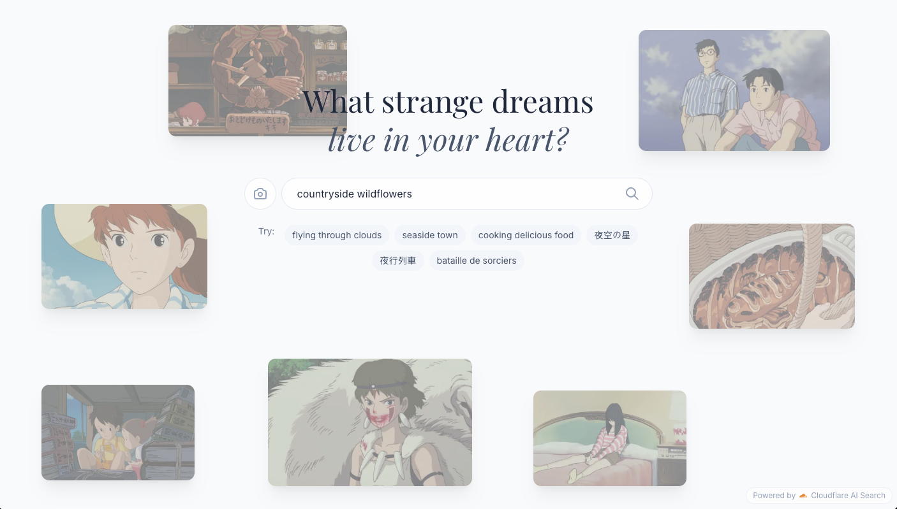
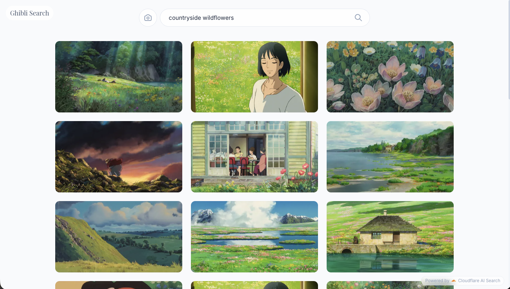
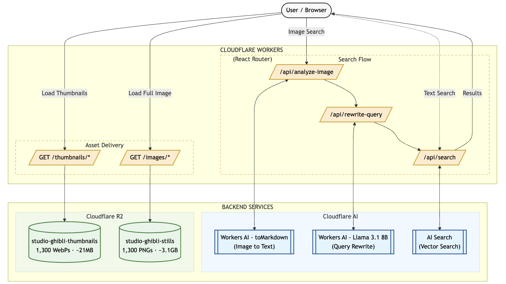

# Studio Ghibli Search

A semantic search engine for Studio Ghibli movie stills, powered by Cloudflare Developer Platform.

**Live Demo:** [ghibli-search.anini.workers.dev](https://ghibli-search.anini.workers.dev/)

<p align="center">
  
  &nbsp;&nbsp;
  
</p>

## Features

- **Semantic search** - Find scenes using natural language queries like "flying through clouds" or "rainy day"
- **Image search** - Upload an image to find visually similar Ghibli scenes

## Architecture



## Tech Stack

- [React Router 7](https://reactrouter.com/) - Full-stack React framework
- [Cloudflare Workers](https://workers.cloudflare.com/) - Serverless functions
- [Cloudflare AI Search](https://developers.cloudflare.com/ai-search/) - Semantic search over images
- [Cloudflare R2](https://developers.cloudflare.com/r2/) - Image storage
- [TailwindCSS 4](https://tailwindcss.com/) - Styling
- TypeScript

## Prerequisites

- Node.js 18+
- A [Cloudflare account](https://dash.cloudflare.com/sign-up) that owns the R2 buckets and AI Search instance below
- Wrangler is installed with the project (`npm install`); you do not need a global install

## Cloudflare resources

This app binds to **remote** Cloudflare resources (see `wrangler.jsonc`). Local `npm run dev` talks to them over a Wrangler remote proxy, so you must be logged into the **same account** that owns them.

| Binding | Resource | Name |
|---|---|---|
| `GHIBLI_BUCKET` | R2 | `studio-ghibli-stills` |
| `THUMBNAILS_BUCKET` | R2 | `studio-ghibli-thumbnails` |
| `GHIBLI_SEARCH` | AI Search instance | `studio-ghibli-google` (R2 source: `studio-ghibli-stills`) |
| `AI` | Workers AI | image analysis (`toMarkdown`) and query rewrite (`AI.run`) |

Stills use this key layout:

```
(YEAR) Movie Name/Scene Description.ext
```

Example: `(1988) My Neighbor Totoro/Flying Through the Sky.png`

Use the same keys in the stills bucket and the thumbnails bucket. File format does not matter.

AI Search indexes the stills bucket in place. The app reads stills and thumbnails from R2 to display them.

Search uses the `ai_search` Workers binding (`env.GHIBLI_SEARCH.search()`), not the legacy `env.AI.autorag()` API. See [Workers binding migration](https://developers.cloudflare.com/ai-search/api/migration/workers-binding/).

## Setup

### 1. Clone and install

```bash
git clone https://github.com/aninibread/ghibli-search.git
cd ghibli-search
npm install
```

### 2. Log in to the correct Cloudflare account

```bash
npx wrangler login
npx wrangler whoami
```

### 3. Upload images to R2

Create the buckets if needed, then upload stills to `studio-ghibli-stills` and matching thumbnails to `studio-ghibli-thumbnails`, using the key layout above.

```bash
npx wrangler r2 bucket create studio-ghibli-stills
npx wrangler r2 bucket create studio-ghibli-thumbnails
npx wrangler r2 bucket info studio-ghibli-stills
npx wrangler r2 bucket info studio-ghibli-thumbnails
```

### 4. Create AI Search with the CLI (R2 source)

Create the search instance with the [AI Search CLI](https://developers.cloudflare.com/ai-search/wrangler-commands/), pointing it at the stills bucket so it indexes those objects in place. Do not copy files into built-in storage.

```bash
npx wrangler ai-search create studio-ghibli-google --type r2 --source studio-ghibli-stills --hybrid-search
```

R2 sources index on a [sync schedule](https://developers.cloudflare.com/ai-search/configuration/indexing/syncing/). Check progress and try a query:

```bash
npx wrangler ai-search stats studio-ghibli-google
npx wrangler ai-search search studio-ghibli-google --query totoro
```

Search returns nothing while **Indexed** is `0`. If you use a different instance name or bucket, update `wrangler.jsonc` to match.

### 5. Generate types and start the app

```bash
npm run cf-typegen
npm run dev
```

The app is at [http://localhost:5173](http://localhost:5173).

`npm run dev` needs a Wrangler remote proxy session. If login is missing or pointed at the wrong account, startup fails with errors like `R2 bucket 'studio-ghibli-stills' not found`.

## Scripts

| Command | Description |
|---------|-------------|
| `npm run dev` | Start development server with HMR |
| `npm run build` | Build for production |
| `npm run preview` | Preview production build locally |
| `npm run deploy` | Build and deploy to Cloudflare Workers |
| `npm run typecheck` | Run TypeScript type checking |
| `npm run cf-typegen` | Generate Worker binding types (`wrangler types`) |

## Project Structure

```
app/
├── components/       # React components
│   ├── image-grid.tsx
│   ├── lightbox.tsx
│   ├── search-header.tsx
│   └── ...
├── lib/              # Utilities and types
│   ├── parse-filename.ts
│   ├── movie-slugs.ts
│   └── types.ts
├── routes/           # React Router routes
│   ├── home.tsx      # Main search page
│   ├── api.search.ts # Search API endpoint
│   ├── images.$.ts   # R2 image serving
│   └── ...
└── root.tsx
workers/
└── app.ts            # Cloudflare Worker entry point
wrangler.jsonc        # Workers bindings (R2, AI, AI Search)
```

## Deployment

```bash
npm run deploy
```

For preview deployments:

```bash
npx wrangler versions upload
```

## License

[MIT](LICENSE)

## Acknowledgments

- Images are from Studio Ghibli films. Studio Ghibli and all related marks are trademarks of Studio Ghibli Inc.
- Visit [ghibli.jp](https://www.ghibli.jp/) for official Studio Ghibli content
